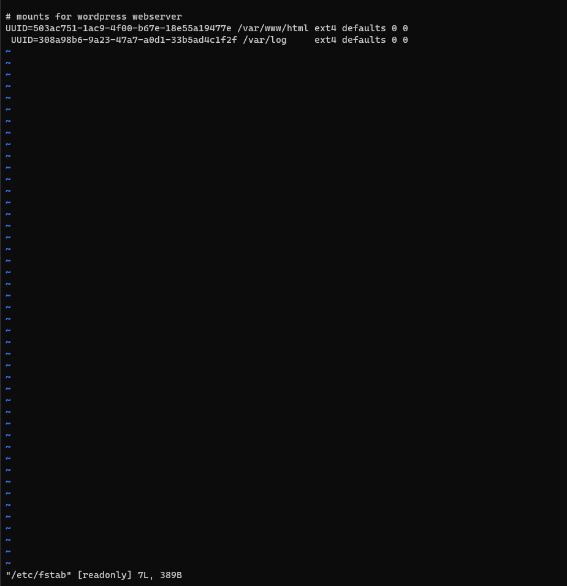

# WEB SOLUTION WITH WORDPRESS

In this project, I will be preparing a storage infrastructire on two linux servers and implementing a basic web solution using word press. 
Wordpress is a free and open-source content management system written in PHP and paired with MySQL or MariaDB as its backend Relational Database Management System (RDBMS).

This project consists of two parts:
1. Configuring the storage subsystem for web and database servers based on Linux OS. 
2. Install WordPress and connect it to a remote MySQL database server. 

## Three-tier Architecture
Three-tier Architecture is a client-server software architecture pattern that comprise of 3 separate layers.
1. Presentation Layer (PL): This is the user interface such as the client server or browser on your laptop.
2. Business Layer (BL): This is the backend program that implements business logic. Application or Webserver
3. Data Access or Management Layer (DAL): This is the layer for computer data storage and data access. Database Server or File System Server such as FTP server, or NFS Server.

The 3-Tier Setup
1. A Laptop or PC to serve as a client
2. An EEC2 Linux Server as a web server (This is where you will install WordPress)
3. An EC2 Linux server as a database (DB) server

# PROJECT IMPLEMENTATION
## PREPARE THE SERVERS
An 2 EC2 instances are created, one will serve as the webserver and the other will be the database server.

3 volumes are created in the same availability zone for each EC2 instance respectively. 

## PREPARING THE WEBSERVER

After the webserver instance has been launched on aws and the volumes have been attached, I ssh into the server for configuration. 

Using `lsblk` to inspect the blocks that have been attached to the server. 


I use `df -h` command to see all mounts and free space on the server. 

I use `gdisk` utility to create single partitions on each of the 3 disks and the results is shown below using `lsblk`. 


I use ` sudo pvcreate /dev/xvdf1 /dev/xvdg1 /dev/xvdh1` utility to mark each of the 3 disks as physical volumes (PVs) to be used by LVM.


I use the `vgcreate` utility to add all 3 PVs to a volume group (VG) named webdata -vg using `sudo vgcreate webdata-vg /dev/xvdh1 /dev/xvdg1 /dev/xvdf1`

I use `lvcreate` utility to create 2 logical volumes. apps-lv (Use half of the PV size), and logs-lv Use the remaining space of the PV size. NOTE: apps-lv will be used to store data for the Website while, logs-lv will be used to store data for logs.
`sudo lvcreate -n apps-lv -L 14G webdata-vg`
`sudo lvcreate -n logs-lv -L 14G webdata-vg`

I verify the whole set up using the `sudo lsblk`. 


I use mkfs.ext4 to format the logical volumes with ext4 filesystem. `sudo mkfs -t ext4 /dev/webdata-vg/apps-lv`
`sudo mkfs -t ext4 /dev/webdata-vg/logs-lv`

**I create /var/www/html directory to store website files
 using `sudo mkdir -p /var/www/html`

I create /home/recovery/logs to store backup of log data using
`sudo mkdir -p /home/recovery/logs`

Mount /var/www/html on apps-lv logical volume
`sudo mount /dev/webdata-vg/apps-lv /var/www/html/`

I use rsync utility to backup all the files in the log directory /var/log into /home/recovery/logs (This is required before mounting the file system) `sudo rsync -av /var/log/. /home/recovery/logs/`

I mount /var/log on logs-lv logical volume. (Note that all the existing data on /var/log will be deleted. That is why the previous step above (**) is very important)
`sudo mount /dev/webdata-vg/logs-lv /var/log`

Restore log files back into /var/log directory
`sudo rsync -av /home/recovery/logs/. /var/log`

I update /etc/fstab file so that the mount configuration will persist after restart of the server.

The UUID of the device will be used to update the /etc/fstab file:



I test the configuration and reload the daemon
`sudo mount -a` `sudo systemctl daemon-reload`

verifying the setup `df -h`


## PREPARE THE DATABASE SERVER
The second EC2 instance 'DB Server' is configured following the same set up as above for the webserver. 
But instead of apps-lv I create db-lv and mount it to /db directory instead of /var/www/html


# INSTALL WORDPRESS ON THE WEBSERVER 
I update the repository
`sudo yum -y update`

Install wget, Apache and it’s dependencies

`sudo yum -y install wget httpd php php-mysqlnd php-fpm php-json`

Start Apache

`sudo systemctl enable httpd`
`sudo systemctl start httpd`

To install PHP and it’s dependencies

```
sudo yum install https://dl.fedoraproject.org/pub/epel/epel-release-latest-8.noarch.rpm
sudo yum install yum-utils http://rpms.remirepo.net/enterprise/remi-release-8.rpm
sudo yum module list php
sudo yum module reset php
sudo yum module enable php
sudo yum install php php-opcache php-gd php-curl php-mysqlnd
sudo systemctl start php-fpm
sudo systemctl enable php-fpm
setsebool -P httpd_execmem 1
```

Restart Apache

`sudo systemctl restart httpd`

Download wordpress and copy wordpress to var/www/html
```
  mkdir wordpress
  cd   wordpress
  sudo wget http://wordpress.org/latest.tar.gz
  sudo tar xzvf latest.tar.gz
  sudo rm -rf latest.tar.gz
  cp wordpress/wp-config-sample.php wordpress/wp-config.php
  cp -R wordpress /var/www/html/
```
Configure SELinux Policies
```
  sudo chown -R apache:apache /var/www/html/wordpress
  sudo chcon -t httpd_sys_rw_content_t /var/www/html/wordpress -R
  sudo setsebool -P httpd_can_network_connect=1
```
## INSTALL MYSQL ON YOUR DB SERVER EC2
```
sudo yum update
sudo yum install mysql-server
```

Verify that the service is up and running by using sudo systemctl status mysqld, if it is not running, restart the service and enable it so it will be running even after reboot:
```
sudo systemctl restart mysqld
sudo systemctl enable mysqld
```

## CONFIGURE DB TO WORK WITH WORDPRESS
```
sudo mysql
CREATE DATABASE wordpress;
CREATE USER `myuser`@`<Web-Server-Private-IP-Address>` IDENTIFIED BY 'mypass';
GRANT ALL ON wordpress.* TO 'myuser'@'<Web-Server-Private-IP-Address>';
FLUSH PRIVILEGES;
SHOW DATABASES;
exit
```

## CONFIGURE WORDPRESS TO CONNECT TO REMOTE DATABASE

Hint: Do not forget to open MySQL port 3306 on DB Server EC2. For extra security, you shall allow access to the DB server ONLY from your Web Server’s IP address, so in the Inbound Rule configuration specify source as /32


Install MySQL client and test that you can connect from your Web Server to your DB server by using mysql-client
sudo yum install mysql
sudo mysql -u admin -p -h <DB-Server-Private-IP-address>
Verify if you can successfully execute SHOW DATABASES; command and see a list of existing databases.

Change permissions and configuration so Apache could use WordPress:

Enable TCP port 80 in Inbound Rules configuration for your Web Server EC2 (enable from everywhere 0.0.0.0/0 or from your workstation’s IP)

Try to access from your browser the link to your WordPress http://<Web-Server-Public-IP-Address>/wordpress/